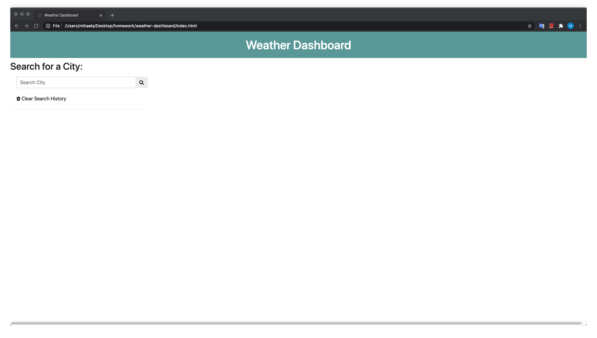

# Weather Dashboard

This project presents to the user the weather in a selected city. 

To get the weather conditions the user hav to search for a city or to select one (by click) from the list in the left. 

When the user click the " Clear Search History " button, the entire content of the screen is deleted.

# Level of difficulty

The concept of API's is very interesting and alow to use different data to create mor interactive web applications. This was one of the most challenging project for me. 

# The deployment link:

https://mihaelavalac.github.io/weather-dashboard/.

